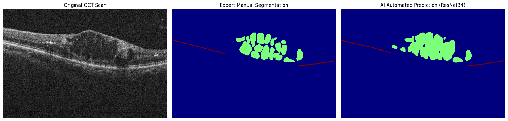
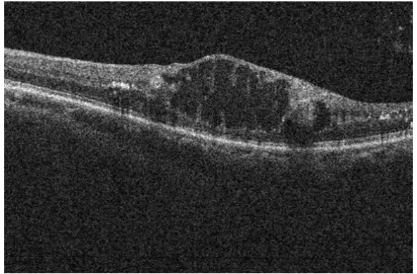
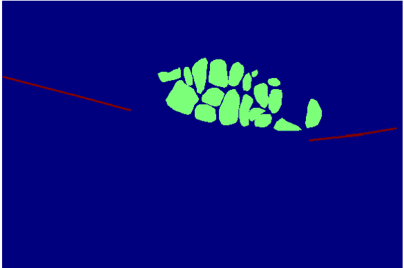
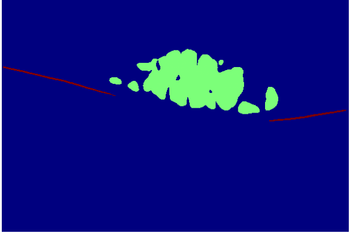

# 🔬 RVO-OCT-Lesion-Segmentation

> Automated multi-class lesion segmentation in Retinal Vein Occlusion (RVO) from OCT B-scans using a ResNet34-backbone U-Net



[](https://www.python.org/)
[](https://tensorflow.org/)
[](https://colab.research.google.com/drive/1EgJNlI8H_CrUUxuAjdVa_aKUrWtXZ8Zf#scrollTo=KRgtHwaUw-Wz)


---

## 🩺 Clinical Background

**Retinal Vein Occlusion (RVO)** is one of the most common retinal vascular disorders and a leading cause of vision impairment worldwide. It occurs when a vein in the retina becomes blocked, leading to fluid leakage and tissue damage.

**Optical Coherence Tomography (OCT)** is the gold-standard imaging modality for diagnosing and monitoring RVO. It produces high-resolution cross-sectional scans (B-scans) of the retina, revealing structural changes that indicate disease severity.

Key lesions visible on OCT in RVO include:
- **SRF** (Subretinal Fluid) — fluid accumulation beneath the retina
- **IRF** (Intraretinal Fluid) — fluid pockets within retinal layers
- **ELM** (External Limiting Membrane) — a structural boundary whose disruption predicts vision loss
- **EZ** (Ellipsoid Zone) — photoreceptor integrity layer; loss correlates with reduced visual acuity

Manual delineation of these lesions is time-consuming and subject to inter-rater variability. Automated segmentation can enable faster diagnosis, consistent monitoring, and scalable screening — especially important in resource-limited settings.

---

## 🎯 Project Overview

This project implements a **deep learning pipeline for automated multi-class OCT lesion segmentation** in RVO patients. The model simultaneously segments 5 classes — Background, SRF, IRF, ELM, and EZ — from full-resolution OCT B-scans.

**Capstone project** for the Executive Programme for AI in Healthcare, IIT Delhi — **Team 10**

| | |
|---|---|
| **Task** | Multi-class semantic segmentation |
| **Input** | OCT B-scans (384 × 576 px, greyscale → 3-channel) |
| **Output** | Per-pixel class mask (5 classes) |
| **Best Mean Dice** | **0.802** |
| **Framework** | TensorFlow / Keras |
| **Platform** | Google Colab Pro |

---

## 🏗️ Architecture

The model uses a **U-Net** architecture with a **ResNet34 ImageNet-pretrained encoder**.

```
Input (384×576×3)
       │
  ResNet34 Encoder (ImageNet weights)
  ├── Block 1 → Skip connection
  ├── Block 2 → Skip connection
  ├── Block 3 → Skip connection
  └── Block 4 → Skip connection (bottleneck)
       │
  Decoder (transposed convolutions + skip fusion)
       │
  Output (384×576×5) → Softmax
```

**Key design choices:**
- ResNet34 encoder chosen over ResNet50 for better performance-to-complexity trade-off (validated via ablation)
- Full-resolution training (384×576) outperformed patch-based (stride-64/32) approaches
- ImageNet pretraining accelerated convergence on limited labelled data

---

## 📊 Experiment Results

11 experiments were conducted systematically varying loss function, resolution strategy, stride, and backbone.

| Run | Architecture | Input | Loss Function | Key Observation | SRF | IRF | ELM | EZ | Mean Dice |
|-----|-------------|-------|---------------|-----------------|-----|-----|-----|----|-----------|
| 1 | Patch U-Net | 64×64 stride=64 | CCE + class weights | Baseline — 15× class weights collapsed SRF to near-zero | 0.062 | 0.293 | 0.391 | 0.500 | 0.388 |
| 2 | Patch U-Net | 64×64 stride=64 | CCE (no weights) | Removed class weights — largest single improvement (+57%) | 0.276 | 0.636 | 0.495 | 0.669 | 0.608 |
| 3 | Patch U-Net | 64×64 stride=32 | CCE (no weights) | Stride=32 overlapping patches + EarlyStopping added | 0.533 | 0.664 | 0.506 | 0.661 | 0.651 |
| 4 | Patch U-Net | 64×64 stride=32 | CCE + Dice | Combined loss — best patch-based result | 0.533 | 0.664 | 0.506 | 0.661 | **0.669** |
| 5 | Patch U-Net | 64×64 stride=32 | Focal + Dice (γ=2.0) | Higher focal gamma — SRF dropped vs Run 4 | 0.470 | 0.650 | 0.480 | 0.650 | 0.650 |
| 6 | Patch U-Net | 64×64 stride=32 | Focal + Dice (γ=0.5) | Lower focal gamma — still below CCE+Dice | 0.460 | 0.640 | 0.475 | 0.645 | 0.642 |
| 7 | ResNet50 U-Net | 64×64 stride=32 | Dice loss | ResNet50 (25M) no ImageNet — SRF & ELM completely failed | 0.000 | 0.525 | 0.000 | 0.667 | 0.432 |
| 8 | ResNet50 U-Net | 64×64 stride=32 | Focal loss | ResNet50 no ImageNet — marginal SRF/ELM recovery | 0.142 | 0.492 | 0.472 | 0.630 | 0.529 |
| 9 | ResNet50 U-Net | 64×64 stride=32 | Focal + Dice (ImageNet) | ResNet50 + ImageNet — overfit before adapting; SRF & ELM failed | 0.000 | 0.525 | 0.000 | 0.667 | 0.432 |
| 10 | Plain U-Net | 384×576 no patch | CCE + Dice | Full resolution — fewer SRF samples per epoch reduced SRF | 0.420 | 0.634 | 0.505 | 0.663 | 0.641 |
| **11** | **ResNet34 U-Net** | **384×576 no patch** | **CCE + Dice (ImageNet)** | **ResNet34 (21M) + ImageNet + full context — best overall ✅** | **0.906** | **0.814** | **0.582** | **0.716** | **0.802** |

> **Best model:** Run 11 — ResNet34 U-Net with ImageNet pretraining, full-resolution input (384×576), combined CCE + Dice loss — Mean Dice 0.802

> **Best patch-based model:** Run 4 — Patch U-Net with CCE + Dice loss, stride=32 — Mean Dice 0.669

> **Key finding:** Runs 7 & 9 show complete failure of SRF and ELM (Dice = 0.000), demonstrating that ResNet50 without appropriate pretraining and full context severely degrades minority class segmentation.

---

## 📁 Repository Structure

```
RVO-OCT-Lesion-Segmentation/
│
├── data/
│   └── sample_images/          # Sample OCT B-scans and ground truth masks
│
├── notebooks/
│   └── Full_resolution_RESNET_34.ipynb   ← Complete end-to-end pipeline
│       ├── Stage 1  — Imports & setup
│       ├── Stage 2  — Mount Drive & data checks
│       ├── Stage 3  — Data loading (mmap_mode='r')
│       ├── Stage 4  — Configuration
│       ├── Stage 5  — Train/Validation split
│       ├── Stage 6  — tf.data pipeline
│       ├── Stage 7  — ResNet34 U-Net model
│       ├── Stage 8  — Loss function (CCE + Dice)
│       ├── Stage 9  — Callbacks
│       ├── Stage 10 — Training
│       ├── Stage 11 — Training curves
│       ├── Stage 12 — Visualisation
│       ├── Stage 13 — Evaluation (Dice, mIoU, Confusion Matrix)
│       └── Stage 14 — Disease classification
│
├── results/
│   ├── experiment_log.csv       # All 11 runs summary
│   └── sample_predictions/      # Visual outputs (image | GT | pred)
│
├── requirements.txt
├── LICENSE
└── README.md
```

---

## ⚙️ Setup & Usage

### Requirements

```bash
pip install -r requirements.txt
```

Key dependencies:
- `tensorflow >= 2.10`
- `segmentation-models` (for ResNet34 U-Net backbone)
- `numpy`, `opencv-python`, `matplotlib`

### Training

```python
# Key configuration
SEED = 42
INPUT_SHAPE = (384, 576, 3)   # Greyscale repeated ×3 for ResNet34
BATCH_SIZE = 2
NUM_CLASSES = 5               # Background, SRF, IRF, ELM, EZ
```

```bash
python src/train.py
```

### Inference

```python
from tensorflow.keras.models import load_model

model = load_model("resnet34_unet_fullres.keras", compile=False)
# Input: (384, 576, 3) greyscale OCT B-scan repeated across channels
```

Or open the Colab demo notebook directly:

[](https://colab.research.google.com/drive/1EgJNlI8H_CrUUxuAjdVa_aKUrWtXZ8Zf#scrollTo=KRgtHwaUw-Wz)

---

## 🖼️ Sample Results

> *(Sample images and prediction masks will be added here)*

| OCT B-scan | Ground Truth | Model Prediction |
|:---:|:---:|:---:|
|  |  |  |

**Colour legend:**

| Class | Colour |
|---|---|
| Background | Black |
| SRF | Blue |
| IRF | Green |
| ELM | Yellow |
| EZ | Red |

---

## 👥 Team

Capstone project by **Team 10**, Executive Programme for AI in Healthcare, IIT Delhi

 **Baby Komal** · Alfred Thomas · Heidrun Zeug · Kiran Kamble · Muneesh Kapoor · Nitika Jesingh · Saptarshi Paul Choudhury · Shivani Sheth · Shuvadeep Ganguly · Sumit Talwar

---

## 🙏 Acknowledgements

- IIT Delhi Executive Programme for AI in Healthcare
- [segmentation-models](https://github.com/qubvel/segmentation_models) library by Pavel Iakubovskii
- Google Colab Pro for compute support
